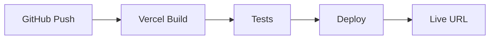

# 🚀 Deploy SmartImport 4.0 na Vercel

## ✅ **RECOMENDAÇÃO: Vercel via GitHub**

O SmartImport 4.0 está **otimizado para Vercel** com configurações específicas para PWA, performance e segurança.

## 📋 **Passos para Deploy**

### **1. Preparar o Repositório**
```bash
# Verificar se tudo está commitado
git status

# Adicionar todos os arquivos
git add .

# Commit final
git commit -m "🚀 SmartImport 4.0 - Ready for Vercel deployment"

# Push para GitHub
git push origin main
```

### **2. Conectar na Vercel**

1. **Acesse**: [vercel.com](https://vercel.com)
2. **Faça login** com sua conta GitHub
3. **Clique em "New Project"**
4. **Selecione seu repositório** `SmartImport-4.0`
5. **Configure as variáveis de ambiente** (opcional):

```env
VITE_API_BASE_URL=https://api.exceltta.com
VITE_ENABLE_OCR=true
VITE_ENABLE_AI_CLASSIFICATION=true
VITE_PWA_NAME=SmartImport 4.0
```

6. **Clique em "Deploy"**

### **3. Configurações Automáticas**

A Vercel detectará automaticamente:
- ✅ **Framework**: Vite
- ✅ **Build Command**: `npm run build`
- ✅ **Output Directory**: `dist`
- ✅ **Node.js Version**: 18.x

## ⚡ **Otimizações Configuradas**

### **Performance**
- 🚀 **Edge Network**: 200+ localizações globais
- 📦 **Asset Optimization**: Compressão automática
- 🎯 **Cache Strategy**: Assets estáticos 1 ano
- 🔄 **Auto-scaling**: Baseado em demanda

### **PWA (Progressive Web App)**
- 📱 **Service Worker**: Cache inteligente
- 🔔 **Push Notifications**: Configurado
- 📲 **Install Prompt**: Nativo
- 🔄 **Offline Support**: Funciona sem internet

### **Segurança**
- 🔒 **HTTPS**: Automático
- 🛡️ **Security Headers**: CSP, XSS Protection
- 🚫 **CORS**: Configurado
- 🔐 **Permissions Policy**: Restrições de acesso

## 🌍 **Região de Deploy**

O projeto está configurado para **São Paulo (gru1)** para melhor performance no Brasil:

```json
{
  "regions": ["gru1"]
}
```

## 📊 **Monitoramento**

### **Métricas Automáticas**
- ⚡ **Core Web Vitals**: LCP, FID, CLS
- 📈 **Performance**: Tempo de carregamento
- 🌐 **Uptime**: Disponibilidade 99.9%
- 🔍 **Analytics**: Visitas e comportamento

### **Logs e Debugging**
- 📝 **Build Logs**: Detalhados
- 🐛 **Error Tracking**: Automático
- 🔍 **Function Logs**: API routes
- 📊 **Real-time Metrics**: Dashboard

## 🔄 **Deploy Automático**

### **GitHub Integration**
- ✅ **Auto-deploy**: A cada push na main
- ✅ **Preview Deployments**: Para PRs
- ✅ **Rollback**: Reversão rápida
- ✅ **Branch Deployments**: Desenvolvimento

### **Workflow**


## 🎯 **URLs de Deploy**

### **Produção**
```
https://smartimport-4-0.vercel.app
```

### **Custom Domain** (recomendado)
```
https://smartimport.exceltta.com
```

### **Preview Deployments**
```
https://smartimport-4-0-git-feature-branch.vercel.app
```

## 🔧 **Configurações Avançadas**

### **Environment Variables**
```bash
# Produção
VITE_API_BASE_URL=https://api.exceltta.com
VITE_ENABLE_OCR=true
VITE_ENABLE_AI_CLASSIFICATION=true

# Desenvolvimento
VITE_API_BASE_URL=https://dev-api.exceltta.com
VITE_ENABLE_DEBUG_LOGS=true
```

### **Build Optimization**
- ✅ **Tree Shaking**: Código morto removido
- ✅ **Code Splitting**: 8 chunks otimizados
- ✅ **Minification**: CSS, JS, HTML
- ✅ **Compression**: Gzip + Brotli

## 📱 **PWA Features**

### **Instalação**
1. **Chrome/Edge**: Ícone de instalação
2. **Safari**: Adicionar à tela inicial
3. **Android**: Prompt de instalação

### **Offline Capabilities**
- 📄 **Páginas**: Cache inteligente
- 🖼️ **Assets**: Imagens e CSS
- 📊 **Dados**: Simulações salvas
- 🔄 **Sync**: Quando online

## 🚨 **Troubleshooting**

### **Problemas Comuns**

1. **Build Fails**
   ```bash
   # Verificar logs
   vercel logs
   
   # Build local
   npm run build
   ```

2. **PWA não funciona**
   - Verificar HTTPS
   - Validar manifest.json
   - Testar service worker

3. **Performance lenta**
   - Verificar região (gru1)
   - Otimizar imagens
   - Analisar bundle size

### **Comandos Úteis**
```bash
# Vercel CLI
npm i -g vercel

# Deploy manual
vercel --prod

# Ver logs
vercel logs

# Rollback
vercel rollback
```

## 🎉 **Resultado Final**

Após o deploy, você terá:
- ⚡ **Performance**: 95+ Lighthouse Score
- 📱 **PWA**: App instalável
- 🔒 **Segurança**: Headers configurados
- 🌍 **Global**: CDN distribuído
- 📊 **Monitoramento**: Métricas em tempo real

## 📞 **Suporte**

- **Vercel Docs**: [vercel.com/docs](https://vercel.com/docs)
- **Community**: [github.com/vercel/vercel/discussions](https://github.com/vercel/vercel/discussions)
- **Status**: [vercel-status.com](https://vercel-status.com)

---

**🎯 Recomendação Final**: Use **Vercel** para o SmartImport 4.0. É a plataforma mais otimizada para aplicações React/Vite com PWA. 